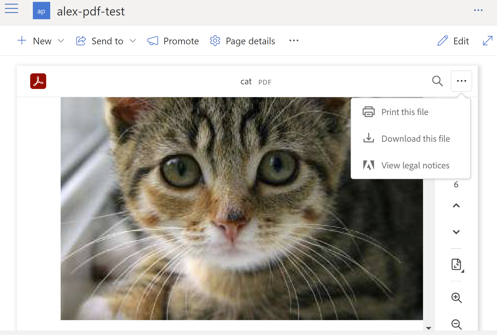

# Adobe PDF Viewer web part for Microsoft SharePoint Online

## Summary

This project contains sample code that implements the core capabilities of the Adobe PDF Embed API for use in a Microsoft SharePoint Framework (SPFx) web part. The Adobe PDF Viewer web part leverages Adobe's PDF viewer. It has been built for use in "site pages" in Microsoft SharePoint Online, and it can render PDF's stored within SharePoint document libraries without losing SharePoint site navigation. Users can easily print or download a PDF from the top bar in the web part. The default page view is configurable in the web part settings. Note that the Adobe PDF SINGLE_PAGE view mode uses the swipe gesture and is optimized for mobile browsers. 

## Used SharePoint Framework Version

SPFx 1.12.1

## Applies to

- [SharePoint Framework](https://aka.ms/spfx)
- [Microsoft 365 tenant](https://docs.microsoft.com/en-us/sharepoint/dev/spfx/set-up-your-developer-tenant)
- [Adobe PDF Embed](https://developer.adobe.com/document-services/apis/pdf-embed)
- [Adobe UI customization for PDF's](https://developer.adobe.com/document-services/docs/overview/pdf-embed-api/howtos_ui/)

## Prerequisites

The PDF Viewer web part requires a client ID which can be created by following the steps here: https://documentcloud.adobe.com/dc-integration-creation-app-cdn/main.html?api=pdf-embed-api. Configure the domain associated with the Adobe client ID as sharepoint.com or MSTENANTNAME.sharepoint.com.

This project was built for and tested with Node.js version v14.19.0

## License

**This project is licensed under the terms of the MIT license.**

Copyright 2022 Adobe

Permission is hereby granted, free of charge, to any person obtaining a copy of this software and associated documentation files (the "Software"), to deal in the Software without restriction, including without limitation the rights to use, copy, modify, merge, publish, distribute, sublicense, and/or sell copies of the Software, and to permit persons to whom the Software is furnished to do so, subject to the following conditions:

The above copyright notice and this permission notice shall be included in all copies or substantial portions of the Software.

THE SOFTWARE IS PROVIDED "AS IS", WITHOUT WARRANTY OF ANY KIND, EXPRESS OR IMPLIED, INCLUDING BUT NOT LIMITED TO THE WARRANTIES OF MERCHANTABILITY, FITNESS FOR A PARTICULAR PURPOSE AND NONINFRINGEMENT. IN NO EVENT SHALL THE AUTHORS OR COPYRIGHT HOLDERS BE LIABLE FOR ANY CLAIM, DAMAGES OR OTHER LIABILITY, WHETHER IN AN ACTION OF CONTRACT, TORT OR OTHERWISE, ARISING FROM, OUT OF OR IN CONNECTION WITH THE SOFTWARE OR THE USE OR OTHER DEALINGS IN THE SOFTWARE.

---

## How to build

- Clone this repository
- Ensure that you are at the project folder
- In the command-line run:
  - **npm install**
  - **gulp bundle --ship**
  - **gulp package-solution --ship**

During the build process it may also be helpful or necessary to run the following:
  - npm audit fix (do not use the --force switch)
  - npx browserslist@latest --update-db

To become familiar with Microsoft's SPFx, you can review the following two Microsoft articles:
  1) https://docs.microsoft.com/en-us/sharepoint/dev/spfx/toolchain/sharepoint-framework-toolchain
  2) https://docs.microsoft.com/en-us/sharepoint/dev/spfx/web-parts/get-started/build-a-hello-world-web-part

